# Piol - Architecture Review & MVP Gap Analysis

## Quick Links

- **Editable Diagram (diagrams.net):** Import `docs/architecture-diagram.drawio` at [app.diagrams.net](https://app.diagrams.net)
- **Direct Edit URL:** `https://app.diagrams.net/#Uhttps://raw.githubusercontent.com/YOUR_ORG/piol/main/docs/architecture-diagram.drawio` (update with your repo URL after pushing)

---

## Current Architecture

```mermaid
flowchart TB
    subgraph Clients["📱 Clients"]
        WEB["Web App<br/>Next.js 16 / React 19<br/>Tailwind 4 / shadcn/ui<br/>next-intl (FR/EN)"]
        MOBILE["Mobile App<br/>Expo / RN 0.81<br/>expo-router<br/>i18next (FR/EN)"]
    end

    subgraph Auth["🔐 Auth"]
        CLERK["Clerk<br/>SSO / OAuth<br/>Webhooks"]
    end

    subgraph Convex["⚡ Convex Backend"]
        subgraph Functions["Functions"]
            USERS["users.ts"]
            PROPS["properties.ts"]
            VERIFY["verifications.ts"]
            TRANS["transactions.ts"]
            MSG["messages.ts"]
            NOTIF["notifications.ts"]
            SAVED["savedProperties.ts"]
            REVIEWS["reviews.ts"]
            FILES["files.ts"]
            HTTP["http.ts"]
        end
        subgraph Actions["Node.js Actions"]
            MTN["mtnMomo.ts"]
            ORANGE["orangeMoney.ts"]
            PAY["payments.ts"]
        end
        SCHEMA[("schema.ts<br/>10 Tables")]
    end

    subgraph External["🌐 External Services"]
        MTN_API["MTN MoMo API"]
        ORANGE_API["Orange Money API"]
        SENTRY["Sentry"]
        STORAGE["Convex Storage"]
    end

    WEB <-->|Convex Client| Convex
    MOBILE <-->|Convex Client| Convex
    WEB <--> CLERK
    MOBILE <--> CLERK
    CLERK -->|Webhooks| HTTP
    Actions --> MTN_API
    Actions --> ORANGE_API
    Convex --> SENTRY
    FILES --> STORAGE
```



---

## Technology Stack

| Layer               | Technology                                  | Status         |
| ------------------- | ------------------------------------------- | -------------- |
| **Web Frontend**    | Next.js 16, React 19, Tailwind 4, shadcn/ui | ✅ Implemented |
| **Mobile Frontend** | Expo SDK 54, React Native 0.81, expo-router | ✅ Implemented |
| **Auth**            | Clerk (SSO, OAuth, Webhooks)                | ✅ Implemented |
| **Backend**         | Convex (serverless functions + database)    | ✅ Implemented |
| **Payments**        | MTN MoMo + Orange Money actions             | 🔶 Skeleton    |
| **i18n**            | next-intl (web) / i18next (mobile)          | ✅ Implemented |
| **Monitoring**      | Sentry (web + mobile)                       | ✅ Configured  |
| **Testing**         | Jest, Playwright (E2E)                      | ✅ Setup       |

---

## Feature Implementation Status

### ✅ Fully Implemented (Backend)

| Feature          | Files                                          | Notes                                                    |
| ---------------- | ---------------------------------------------- | -------------------------------------------------------- |
| User Management  | `users.ts`                                     | CRUD, roles (renter/landlord/admin/verifier), Clerk sync |
| Properties       | `properties.ts`                                | CRUD, search index, filters, landlord ownership          |
| Verifications    | `verifications.ts`                             | Claim, update, complete workflow                         |
| Transactions     | `transactions.ts`                              | Create, status updates, escrow release/refund            |
| Messages         | `messages.ts`                                  | Conversations, send, mark-read, unread count             |
| Notifications    | `notifications.ts`                             | Create, list, mark-read/all                              |
| Saved Properties | `savedProperties.ts`                           | Save/unsave toggle, list favorites                       |
| Reviews          | `reviews.ts`, `schema.ts`                      | Schema ready                                             |
| Tenant Screening | `schema.ts`                                    | Schema ready                                             |
| Payment Actions  | `actions/mtnMomo.ts`, `actions/orangeMoney.ts` | API integration code written                             |

### 🔶 Stubbed / Not Wired (UI)

| Feature            | Location                                        | Issue                             |
| ------------------ | ----------------------------------------------- | --------------------------------- |
| Properties Listing | `web/src/app/properties/page.tsx`               | Uses mock array, not Convex query |
| Property Detail    | `web/src/app/properties/[id]/page.tsx`          | Uses mock object                  |
| Dashboard Stats    | `web/src/components/section-cards.tsx`          | Hardcoded numbers                 |
| My Properties      | `web/src/app/dashboard/properties/page.tsx`     | Mock data                         |
| New Property       | `web/src/app/dashboard/properties/new/page.tsx` | `console.log` only, no mutation   |
| Mobile Home        | `mobile/app/(tabs)/index.tsx`                   | Falls back to mock data           |
| Messages UI        | `web/src/app/dashboard/messages/page.tsx`       | Placeholder only                  |
| Payments UI        | —                                               | No UI flow exists                 |
| Maps               | Property detail                                 | "Coming soon" placeholder         |

### 🔴 Missing for MVP

#### Critical (Must-Have for Launch)

1. **Wire Web UI to Convex**

   - Replace all mock data with live queries
   - Connect new property form to `createProperty` mutation
   - Connect image upload to Convex file storage

2. **Payment Flow UI**

   - Renter: Initiate payment → MTN/Orange prompt → status polling
   - Landlord: View pending payments → release escrow
   - Transaction history page

3. **Real Messaging UI**

   - Conversation list with real-time updates
   - Chat interface with send/receive
   - Unread badge in navigation

4. **Image Upload**
   - Connect to `files.ts` (generateUploadUrl)
   - Display uploaded images from storage URLs

#### Important (High-Value)

5. **Verifier Dashboard**

   - List pending properties for verification
   - Claim/complete verification flow
   - Upload visit photos + documents

6. **Admin Dashboard**

   - User management (role changes, ID verification)
   - Transaction stats
   - Verification stats

7. **Property Analytics**

   - Views count (needs tracking)
   - Inquiries count
   - Revenue dashboard for landlords

8. **Push Notifications**
   - Configure Expo push tokens
   - Send on new message, payment, verification status

#### Nice-to-Have (Post-MVP)

9. Maps Integration (Google Maps / OSM)
10. Offline Mode (cached listings)
11. Tenant Screening UI
12. Reviews UI
13. Digital Lease Generation

---

## MVP Backlog (Prioritized)

### Sprint 1: Core Wiring (2 weeks)

| Task                                                   | Priority | Effort |
| ------------------------------------------------------ | -------- | ------ |
| Wire properties listing to `listProperties` query      | P0       | 2h     |
| Wire property detail to `getProperty` query            | P0       | 2h     |
| Connect new property form to `createProperty` mutation | P0       | 4h     |
| Implement image upload to Convex storage               | P0       | 4h     |
| Wire dashboard stats to real queries                   | P1       | 3h     |
| Wire my properties list                                | P1       | 2h     |
| Wire mobile home to Convex                             | P1       | 3h     |

### Sprint 2: Messaging & Notifications (1.5 weeks)

| Task                          | Priority | Effort |
| ----------------------------- | -------- | ------ |
| Build conversation list UI    | P0       | 4h     |
| Build chat interface UI       | P0       | 6h     |
| Real-time message updates     | P0       | 3h     |
| Unread count badge            | P1       | 2h     |
| In-app notifications dropdown | P1       | 4h     |

### Sprint 3: Payments (2 weeks)

| Task                                                  | Priority | Effort |
| ----------------------------------------------------- | -------- | ------ |
| Payment initiation modal (select method, enter phone) | P0       | 6h     |
| MTN MoMo payment flow + polling                       | P0       | 8h     |
| Orange Money redirect flow                            | P0       | 6h     |
| Transaction history page                              | P1       | 4h     |
| Escrow release UI (landlord)                          | P1       | 4h     |

### Sprint 4: Verification & Admin (1.5 weeks)

| Task                                     | Priority | Effort |
| ---------------------------------------- | -------- | ------ |
| Verifier dashboard - pending list        | P1       | 4h     |
| Verifier dashboard - claim/complete flow | P1       | 6h     |
| Admin dashboard - user list              | P2       | 4h     |
| Admin dashboard - stats                  | P2       | 3h     |

### Sprint 5: Polish & Launch (1 week)

| Task                            | Priority | Effort |
| ------------------------------- | -------- | ------ |
| Push notifications setup        | P1       | 6h     |
| Error handling & loading states | P1       | 4h     |
| Mobile parity check             | P1       | 4h     |
| Performance optimization        | P2       | 4h     |
| Security audit                  | P0       | 8h     |

---

## Competitive Edge vs Kasastay

Based on pitch deck differentiators:

| Differentiator                       | Current Status           | Gap to Close                       |
| ------------------------------------ | ------------------------ | ---------------------------------- |
| **Trust-first verification**         | Backend ready, no UI     | Build verifier dashboard           |
| **Payment innovation (MoMo/Orange)** | Actions written, no UI   | Build payment flow UI              |
| **Better UX**                        | Modern stack, i18n ready | Wire real data, add loading states |
| **Lower fees (5% vs 8-16%)**         | Configurable in code     | Marketing copy                     |
| **Pay-as-you-go rent**               | Schema supports it       | Phase 2 feature                    |

---

## Estimated Timeline to MVP

| Phase                   | Duration    | Outcome                     |
| ----------------------- | ----------- | --------------------------- |
| Sprint 1 (Core)         | 2 weeks     | Properties fully functional |
| Sprint 2 (Messaging)    | 1.5 weeks   | Real-time chat working      |
| Sprint 3 (Payments)     | 2 weeks     | Can accept rent payments    |
| Sprint 4 (Verification) | 1.5 weeks   | Verification workflow live  |
| Sprint 5 (Polish)       | 1 week      | Launch-ready                |
| **Total**               | **8 weeks** | **MVP Launch**              |

---

## Files to Edit

### Highest Priority

1. `web/src/app/properties/page.tsx` — Replace mock with Convex
2. `web/src/app/properties/[id]/page.tsx` — Replace mock with Convex
3. `web/src/app/dashboard/properties/new/page.tsx` — Connect to mutation
4. `web/src/app/dashboard/messages/page.tsx` — Build real UI
5. `web/src/app/dashboard/payments/page.tsx` — Build payment flow

### New Files Needed

1. `web/src/app/dashboard/admin/page.tsx` — Admin dashboard
2. `web/src/app/dashboard/verifier/page.tsx` — Verifier dashboard
3. `web/src/components/payment-modal.tsx` — Payment initiation
4. `web/src/components/chat-interface.tsx` — Messaging UI

---

## How to Use the Diagram

1. Go to [app.diagrams.net](https://app.diagrams.net)
2. File → Import from → Device
3. Select `docs/architecture-diagram.drawio`
4. Edit as needed, export as PNG/SVG for presentations

Or after pushing to GitHub:

```
https://app.diagrams.net/#Uhttps://raw.githubusercontent.com/YOUR_ORG/piol/main/docs/architecture-diagram.drawio
```

---

_Generated: January 3, 2026_
