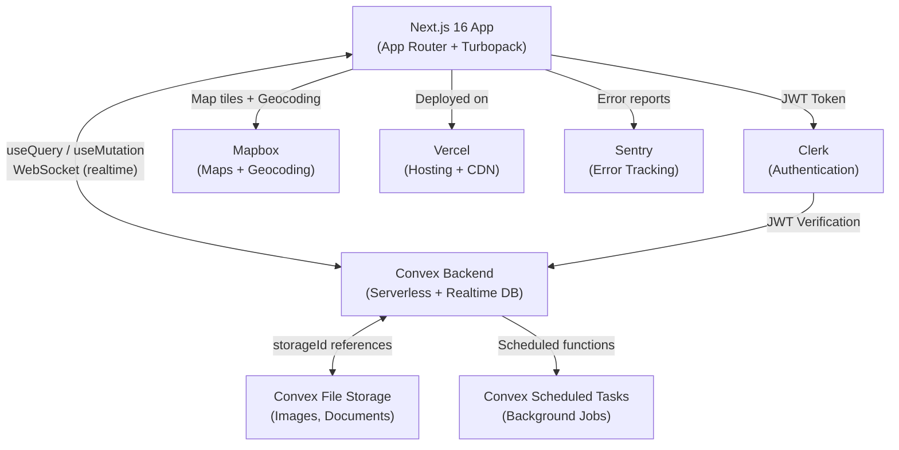
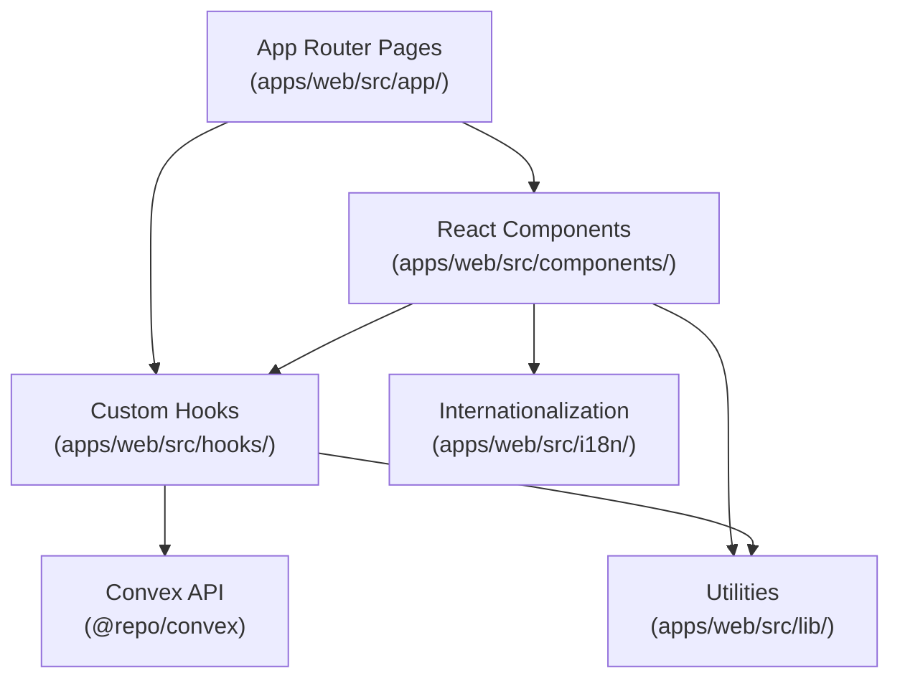
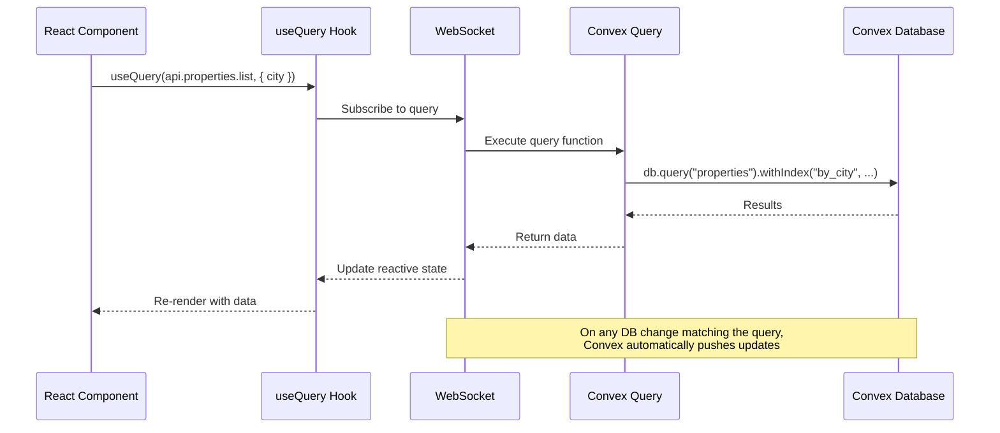
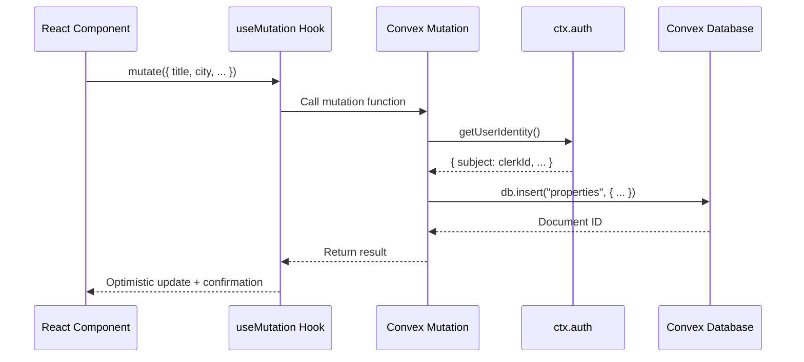
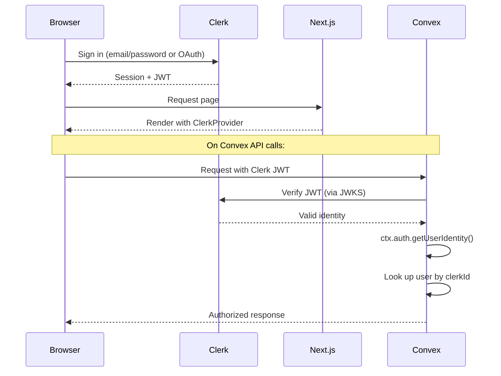

# Architecture

This document describes the system architecture of Piol, a Cameroon housing marketplace built as a monorepo with a Next.js frontend and Convex serverless backend.

## Table of Contents

- [System Overview](#system-overview)
- [Component Layers](#component-layers)
- [Data Flow](#data-flow)
- [Authentication Flow](#authentication-flow)
- [Monorepo Structure](#monorepo-structure)
- [Key Architectural Decisions](#key-architectural-decisions)

## System Overview



## Component Layers

The frontend follows a layered architecture:



### Pages (`apps/web/src/app/`)

Next.js App Router pages that define routes and layouts. Server Components by default, Client Components only when interactivity is needed.

Key routes:
- `/` - Public landing page
- `/properties` - Public property search and listing
- `/properties/[id]` - Public property detail
- `/dashboard` - Authenticated dashboard (role-dependent layout)
- `/dashboard/properties` - Landlord property management
- `/dashboard/admin` - Admin panel (user/application management)
- `/dashboard/verify` - Verifier panel
- `/dashboard/messages` - Messaging between users
- `/dashboard/payments` - Payment history
- `/dashboard/settings` - User settings

### Components (`apps/web/src/components/`)

Reusable React components built with shadcn/ui and Tailwind v4. Organized by feature domain (e.g., `properties/`, `layouts/`).

### Hooks (`apps/web/src/hooks/`)

Custom React hooks encapsulating business logic, Convex queries/mutations, and authentication state.

### Convex API (`packages/convex/convex/`)

Backend functions organized by domain:
- `users.ts` - User CRUD, profile management
- `properties.ts` - Property listing, search, CRUD
- `messages.ts` - Messaging between users
- `transactions.ts` - Payment tracking
- `verifications.ts` - Property verification workflow
- `landlordApplications.ts` - Landlord application review
- `savedProperties.ts` - Favorites/bookmarks
- `reviews.ts` - Property and user reviews
- `notifications.ts` - User notifications
- `files.ts` - File upload/download URLs
- `http.ts` - HTTP routes (webhooks)

## Data Flow

### Reading Data (Realtime)



### Writing Data



## Authentication Flow

Authentication uses Clerk for identity management with Convex for backend authorization.



### Provider Hierarchy

The app wraps components in nested providers (see `apps/web/src/app/providers.tsx`):

```
ClerkProvider (authentication)
  └── ThemeProvider (dark/light mode via next-themes)
      └── ConvexProviderWithClerk (realtime backend + auth bridge)
          └── QueryClientProvider (TanStack Query for non-Convex data)
              └── GTProvider (internationalization via gt-next)
                  └── App Content
```

### Role-Based Access

Users have one of four roles: `renter`, `landlord`, `admin`, `verifier`. The dashboard layout (`apps/web/src/app/dashboard/layout.tsx`) adapts based on role:

- **Renter**: Tab-based navigation layout (mobile-friendly)
- **Landlord**: Sidebar navigation layout
- **Admin**: Sidebar navigation with admin panel access
- **Verifier**: Sidebar navigation with verification panel access

## Monorepo Structure

```
piol/
├── apps/
│   └── web/                          # @repo/web - Next.js 16 web app
│       ├── src/
│       │   ├── app/                  # App Router pages and layouts
│       │   ├── components/           # React components (shadcn/ui based)
│       │   ├── hooks/                # Custom React hooks
│       │   ├── lib/                  # Utilities, validations, env config
│       │   └── i18n/                 # Internationalization (en/fr locales)
│       └── e2e/                      # Playwright E2E tests
│           ├── fixtures/             # Test fixtures (auth)
│           ├── pages/                # Page object models
│           └── tests/                # Test specs
├── packages/
│   ├── convex/                       # @repo/convex - Convex backend
│   │   ├── convex/                   # Backend functions and schema
│   │   └── __tests__/                # Backend unit tests (vitest)
│   ├── ui/                           # @repo/ui - Shared UI components
│   ├── types/                        # @repo/types - Shared TypeScript types
│   └── config/                       # @repo/config - Shared configuration
├── turbo.json                        # Turborepo task configuration
├── biome.json                        # Biome linter/formatter config
└── package.json                      # Root workspace config
```

### Package Responsibilities

| Package | Name | Purpose |
|---------|------|---------|
| `apps/web` | `@repo/web` | Next.js 16 frontend with App Router, Turbopack dev server |
| `packages/convex` | `@repo/convex` | Convex backend: schema, queries, mutations, actions, HTTP routes |
| `packages/ui` | `@repo/ui` | Shared UI components across apps |
| `packages/types` | `@repo/types` | Shared TypeScript type definitions |
| `packages/config` | `@repo/config` | Shared configuration (e.g., Tailwind, TypeScript) |

### Build Tool Chain

- **Turborepo** orchestrates builds across packages with caching
- **Bun** is the package manager and JavaScript runtime
- **Biome** handles linting and formatting (replaces ESLint + Prettier)
- **TypeScript** for type safety across all packages

## Key Architectural Decisions

### Why Convex over traditional REST/GraphQL?

- **Realtime by default**: All queries automatically subscribe to changes via WebSocket
- **No API layer to maintain**: Functions are called directly from the client
- **ACID transactions**: Mutations run in database transactions
- **Integrated file storage**: No separate S3/Cloudinary setup needed
- **Serverless scaling**: No infrastructure management

### Why Clerk for auth?

- **Pre-built UI components**: Sign-in/sign-up forms with localization
- **JWT integration with Convex**: Native `ConvexProviderWithClerk` bridge
- **Webhook-based sync**: User data syncs to Convex via Clerk webhooks (`packages/convex/convex/http.ts`)
- **Multi-language**: Supports French and English localizations

### Why Tailwind v4 + shadcn/ui?

- **Design tokens**: Consistent theming via CSS variables (no hardcoded colors)
- **Composable components**: shadcn/ui components are copied into the project and fully customizable
- **Dark mode**: Built-in with `next-themes` provider

### Why Turborepo + Bun?

- **Fast installs**: Bun's package manager is significantly faster than npm/yarn
- **Task caching**: Turborepo caches build/lint/typecheck results
- **Parallel execution**: Independent tasks run simultaneously
- **Workspace protocol**: Clean dependency management between packages
