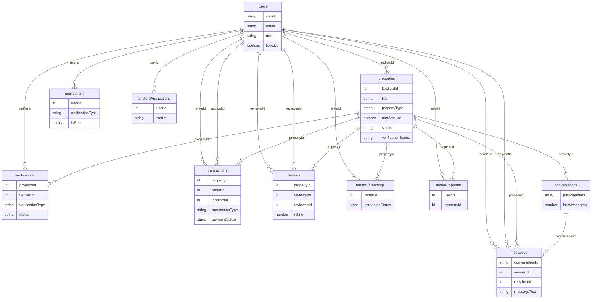
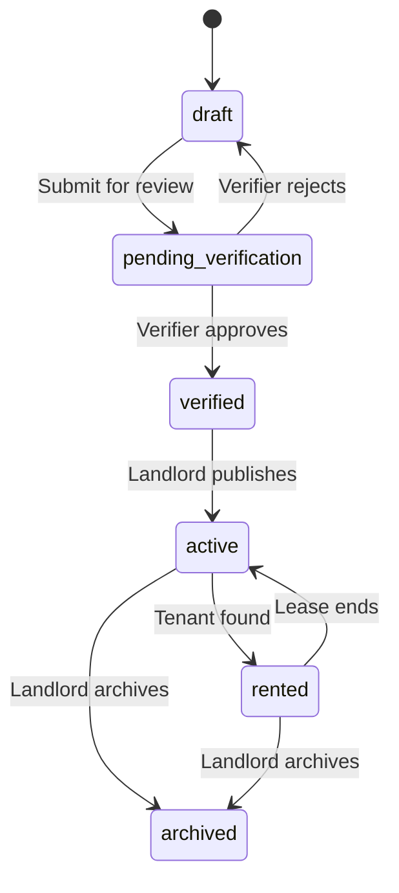

# Database Schema

This document describes all tables, fields, indexes, and relationships in the Convex database. The source of truth is `packages/convex/convex/schema.ts`.

## Table of Contents

- [Entity Relationship Diagram](#entity-relationship-diagram)
- [Tables](#tables)
  - [users](#users)
  - [properties](#properties)
  - [verifications](#verifications)
  - [transactions](#transactions)
  - [messages](#messages)
  - [conversations](#conversations)
  - [reviews](#reviews)
  - [tenantScreenings](#tenantscreenings)
  - [notifications](#notifications)
  - [landlordApplications](#landlordapplications)
  - [savedProperties](#savedproperties)
- [Schema Patterns](#schema-patterns)

## Entity Relationship Diagram

## Tables

### users

Stores all registered users. Synced from Clerk via webhooks.

| Field | Type | Required | Description |
|-------|------|----------|-------------|
| `clerkId` | `string` | Yes | Clerk user identifier (links to Clerk auth) |
| `email` | `string` | Yes | User email address |
| `phone` | `string` | No | Phone number |
| `role` | `"renter" \| "landlord" \| "admin" \| "verifier"` | Yes | User role determining access level |
| `firstName` | `string` | No | First name |
| `lastName` | `string` | No | Last name |
| `languagePreference` | `"fr" \| "en"` | Yes | Preferred language |
| `emailVerified` | `boolean` | Yes | Whether email is verified |
| `phoneVerified` | `boolean` | Yes | Whether phone is verified |
| `idVerified` | `boolean` | Yes | Whether government ID is verified |
| `profileImageUrl` | `string` | No | URL to profile image (external) |
| `profileImageId` | `Id<"_storage">` | No | Convex storage ID for profile image |
| `lastLogin` | `number` | No | Unix timestamp of last login |
| `isActive` | `boolean` | Yes | Whether the account is active |
| `onboardingCompleted` | `boolean` | No | Whether user has completed onboarding flow |

**Indexes:**

| Index Name | Fields | Purpose |
|------------|--------|---------|
| `by_clerk_id` | `clerkId` | Look up user by Clerk ID (auth integration) |
| `by_email` | `email` | Look up user by email |
| `by_phone` | `phone` | Look up user by phone number |
| `by_role` | `role` | List users by role (admin user management) |

---

### properties

Stores property listings created by landlords.

| Field | Type | Required | Description |
|-------|------|----------|-------------|
| `landlordId` | `Id<"users">` | Yes | Reference to the landlord user |
| `title` | `string` | Yes | Property listing title |
| `description` | `string` | No | Detailed property description |
| `propertyType` | `"studio" \| "1br" \| "2br" \| "3br" \| "4br" \| "house" \| "apartment" \| "villa"` | Yes | Type of property |
| `rentAmount` | `number` | Yes | Monthly rent in specified currency |
| `currency` | `string` | Yes | Currency code (default: `"XAF"` - Central African CFA franc) |
| `cautionMonths` | `number` | Yes | Number of months required as security deposit (default: 2) |
| `upfrontMonths` | `number` | Yes | Number of months required upfront (default: 6) |
| `location` | `{ latitude, longitude }` | No | GPS coordinates |
| `addressLine1` | `string` | No | Street address |
| `addressLine2` | `string` | No | Additional address info |
| `city` | `string` | Yes | City name (e.g., "Douala", "Yaounde") |
| `neighborhood` | `string` | No | Neighborhood/quarter name |
| `landmarks` | `string` | No | Nearby landmarks for navigation |
| `amenities` | `object` | No | Boolean flags: wifi, parking, ac, security, water247, electricity247, furnished, balcony, garden |
| `images` | `array` | No | Array of `{ storageId, order, caption }` for uploaded images |
| `placeholderImages` | `string[]` | No | External image URLs for development/seeding |
| `status` | `"draft" \| "pending_verification" \| "verified" \| "active" \| "rented" \| "archived"` | Yes | Property lifecycle status |
| `verificationStatus` | `"pending" \| "in_progress" \| "approved" \| "rejected"` | Yes | Verification workflow status |
| `verifiedAt` | `number` | No | Timestamp when property was verified |
| `verifierId` | `Id<"users">` | No | Reference to the verifier who approved the property |
| `publishedAt` | `number` | No | Timestamp when property was published |
| `searchText` | `string` | No | Concatenated searchable text for full-text search |

**Indexes:**

| Index Name | Fields | Purpose |
|------------|--------|---------|
| `by_landlord` | `landlordId` | List all properties for a landlord |
| `by_status` | `status` | Filter properties by lifecycle status |
| `by_city` | `city` | Filter properties by city |
| `by_city_status` | `city, status` | Filter by city and status (compound) |
| `by_city_status_type` | `city, status, propertyType` | Filter by city, status, and type |
| `by_verification_status` | `verificationStatus` | List properties by verification state |
| `by_status_and_verificationStatus` | `status, verificationStatus` | Compound filter for admin/verifier views |
| `search_properties` (search index) | `searchText` (filtered by `city, status, propertyType`) | Full-text search on property content |

**Property Status Lifecycle:**

---

### verifications

Tracks the verification process for properties.

| Field | Type | Required | Description |
|-------|------|----------|-------------|
| `propertyId` | `Id<"properties">` | Yes | Property being verified |
| `verifierId` | `Id<"users">` | Yes | Verifier performing the check |
| `verificationType` | `"property_visit" \| "ownership_document" \| "id_verification"` | Yes | Type of verification |
| `status` | `"pending" \| "in_progress" \| "approved" \| "rejected"` | Yes | Verification status |
| `notes` | `string` | No | Verifier notes |
| `documents` | `array` | No | Array of `{ type, storageId, verified }` documents |
| `visitDate` | `number` | No | Scheduled visit timestamp |
| `visitPhotos` | `array` | No | Array of `{ storageId, timestamp }` photos from visit |
| `completedAt` | `number` | No | Completion timestamp |

**Indexes:**

| Index Name | Fields | Purpose |
|------------|--------|---------|
| `by_property` | `propertyId` | List verifications for a property |
| `by_property_and_verificationType` | `propertyId, verificationType` | Check if specific verification type exists for property |
| `by_verifier` | `verifierId` | List verifications assigned to a verifier |
| `by_status` | `status` | Filter by verification status |
| `by_verifier_and_status` | `verifierId, status` | Verifier's pending/active verifications |

---

### transactions

Tracks all financial transactions (rent payments, deposits, commissions, refunds).

| Field | Type | Required | Description |
|-------|------|----------|-------------|
| `propertyId` | `Id<"properties">` | Yes | Property related to the transaction |
| `renterId` | `Id<"users">` | Yes | Renter making the payment |
| `landlordId` | `Id<"users">` | Yes | Landlord receiving the payment |
| `transactionType` | `"rent_payment" \| "deposit" \| "commission" \| "refund"` | Yes | Type of transaction |
| `amount` | `number` | Yes | Transaction amount |
| `currency` | `string` | Yes | Currency code (default: `"XAF"`) |
| `paymentMethod` | `"mtn_momo" \| "orange_money" \| "bank_transfer" \| "cash"` | Yes | Payment method used |
| `paymentStatus` | `"pending" \| "processing" \| "completed" \| "failed" \| "refunded"` | Yes | Current payment status |
| `escrowStatus` | `"held" \| "released" \| "refunded"` | No | Escrow state for secure payments |
| `mobileMoneyReference` | `string` | No | Mobile money provider reference |
| `transactionReference` | `string` | Yes | Internal unique reference |
| `completedAt` | `number` | No | Completion timestamp |
| `payerPhone` | `string` | No | Phone used for mobile money payment |
| `externalId` | `string` | No | External payment provider ID |
| `callbackReceived` | `boolean` | No | Whether payment callback was received |

**Indexes:**

| Index Name | Fields | Purpose |
|------------|--------|---------|
| `by_property` | `propertyId` | List transactions for a property |
| `by_renter` | `renterId` | List a renter's transactions |
| `by_landlord` | `landlordId` | List a landlord's transactions |
| `by_status` | `paymentStatus` | Filter by payment status |
| `by_reference` | `transactionReference` | Look up by reference (webhook processing) |
| `by_renter_and_paymentStatus` | `renterId, paymentStatus` | Renter's transactions by status |
| `by_landlord_and_paymentStatus` | `landlordId, paymentStatus` | Landlord's transactions by status |

---

### messages

Individual messages within conversations.

| Field | Type | Required | Description |
|-------|------|----------|-------------|
| `conversationId` | `string` | Yes | Conversation this message belongs to |
| `senderId` | `Id<"users">` | Yes | User who sent the message |
| `recipientId` | `Id<"users">` | Yes | User who receives the message |
| `propertyId` | `Id<"properties">` | No | Related property (if property inquiry) |
| `messageText` | `string` | Yes | Message content |
| `isRead` | `boolean` | Yes | Whether the recipient has read the message |

**Indexes:**

| Index Name | Fields | Purpose |
|------------|--------|---------|
| `by_conversation` | `conversationId` | List messages in a conversation |
| `by_conversation_and_recipient_and_isRead` | `conversationId, recipientId, isRead` | Unread message count for a user in a conversation |
| `by_sender` | `senderId` | List messages sent by a user |
| `by_recipient` | `recipientId` | List messages received by a user |
| `by_recipient_and_isRead` | `recipientId, isRead` | Total unread count for a user |
| `by_property` | `propertyId` | Messages about a specific property |

---

### conversations

Metadata for conversations between users, used for listing conversation previews.

| Field | Type | Required | Description |
|-------|------|----------|-------------|
| `participantIds` | `Id<"users">[]` | Yes | Array of user IDs in the conversation |
| `propertyId` | `Id<"properties">` | No | Related property (if applicable) |
| `lastMessageAt` | `number` | Yes | Timestamp of the most recent message |
| `lastMessagePreview` | `string` | No | Preview text of the last message |

**Indexes:**

| Index Name | Fields | Purpose |
|------------|--------|---------|
| `by_participants` | `participantIds` | Find conversations by participant list |
| `by_participants_and_propertyId` | `participantIds, propertyId` | Find conversation for specific participants about a property |
| `by_last_message` | `lastMessageAt` | Sort conversations by recent activity |

---

### reviews

User and property reviews.

| Field | Type | Required | Description |
|-------|------|----------|-------------|
| `propertyId` | `Id<"properties">` | Yes | Property being reviewed |
| `reviewerId` | `Id<"users">` | Yes | User writing the review |
| `revieweeId` | `Id<"users">` | Yes | User being reviewed |
| `reviewType` | `"landlord_review" \| "tenant_review" \| "property_review"` | Yes | Type of review |
| `rating` | `number` | Yes | Rating from 1 to 5 |
| `comment` | `string` | No | Review text |

**Indexes:**

| Index Name | Fields | Purpose |
|------------|--------|---------|
| `by_property` | `propertyId` | List reviews for a property |
| `by_property_and_reviewer_and_reviewType` | `propertyId, reviewerId, reviewType` | Check if user already reviewed (prevent duplicates) |
| `by_reviewee` | `revieweeId` | List reviews about a user |
| `by_reviewer` | `reviewerId` | List reviews written by a user |

---

### tenantScreenings

Tenant background screening data collected during the rental application process.

| Field | Type | Required | Description |
|-------|------|----------|-------------|
| `renterId` | `Id<"users">` | Yes | Renter being screened |
| `propertyId` | `Id<"properties">` | No | Property applied for |
| `employmentStatus` | `string` | No | Current employment status |
| `employerName` | `string` | No | Employer name |
| `monthlyIncome` | `number` | No | Monthly income amount |
| `previousRentalHistory` | `array` | No | Array of `{ landlordName, landlordPhone, duration, reason }` |
| `references` | `array` | No | Array of `{ name, phone, relationship }` |
| `screeningStatus` | `"pending" \| "in_progress" \| "completed" \| "failed"` | Yes | Screening workflow status |
| `screeningScore` | `number` | No | Computed screening score |
| `completedAt` | `number` | No | Completion timestamp |

**Indexes:**

| Index Name | Fields | Purpose |
|------------|--------|---------|
| `by_renter` | `renterId` | List screenings for a renter |
| `by_property` | `propertyId` | List screenings for a property |
| `by_status` | `screeningStatus` | Filter by screening status |

---

### notifications

In-app notifications for users.

| Field | Type | Required | Description |
|-------|------|----------|-------------|
| `userId` | `Id<"users">` | Yes | User receiving the notification |
| `notificationType` | `string` | Yes | Type identifier (e.g., "new_message", "verification_complete") |
| `title` | `string` | Yes | Notification title |
| `message` | `string` | Yes | Notification body text |
| `data` | `any` | No | Additional data payload |
| `isRead` | `boolean` | Yes | Whether the notification has been read |
| `actionUrl` | `string` | No | URL to navigate to when notification is clicked |

**Indexes:**

| Index Name | Fields | Purpose |
|------------|--------|---------|
| `by_user` | `userId` | List all notifications for a user |
| `by_user_unread` | `userId, isRead` | List unread notifications for a user |

---

### landlordApplications

Tracks applications from renters who want to become landlords. Includes ID verification documents.

| Field | Type | Required | Description |
|-------|------|----------|-------------|
| `userId` | `Id<"users">` | Yes | User applying to be a landlord |
| `status` | `"pending" \| "approved" \| "rejected"` | Yes | Application status |
| `cniPhotoFront` | `Id<"_storage">` | Yes | Front of national ID card (Convex storage) |
| `cniPhotoBack` | `Id<"_storage">` | Yes | Back of national ID card (Convex storage) |
| `motivationText` | `string` | Yes | Applicant's motivation text |
| `rejectionReason` | `string` | No | Reason for rejection (if rejected) |
| `reviewedBy` | `Id<"users">` | No | Admin who reviewed the application |
| `reviewedAt` | `number` | No | Review timestamp |

**Indexes:**

| Index Name | Fields | Purpose |
|------------|--------|---------|
| `by_userId` | `userId` | Look up application by user |
| `by_status` | `status` | List applications by status (admin queue) |
| `by_userId_and_status` | `userId, status` | Check if user has pending application |

---

### savedProperties

Junction table for user bookmarks/favorites.

| Field | Type | Required | Description |
|-------|------|----------|-------------|
| `userId` | `Id<"users">` | Yes | User who saved the property |
| `propertyId` | `Id<"properties">` | Yes | Property that was saved |

**Indexes:**

| Index Name | Fields | Purpose |
|------------|--------|---------|
| `by_user` | `userId` | List saved properties for a user |
| `by_property` | `propertyId` | List users who saved a property |
| `by_user_property` | `userId, propertyId` | Check if a specific user saved a specific property (toggle) |

## Schema Patterns

### Timestamps

All timestamps are stored as Unix epoch numbers (`v.number()`), not ISO strings. Convex automatically adds `_creationTime` to every document.

### References

Foreign keys use `v.id("tableName")` which enforces referential integrity at the type level. Convex does not enforce cascading deletes, so application code must handle cleanup.

### Status Enums

Status fields use `v.union(v.literal(...), ...)` pattern for type-safe string enums. This ensures only valid status values can be stored.

### Indexes

Every query path has a corresponding index. Convex does not support table scans in production, so indexes are required for all query patterns. Index naming follows the convention `by_field1_and_field2`.

### Full-Text Search

The `properties` table uses a Convex search index (`search_properties`) on the `searchText` field with filter fields for `city`, `status`, and `propertyType`. The `searchText` field is a concatenated string built from title, description, city, neighborhood, and other searchable fields.

### File Storage

File references use `v.id("_storage")` pointing to Convex's built-in file storage. Files are uploaded via generated upload URLs and accessed via generated download URLs (see `packages/convex/convex/files.ts`).
