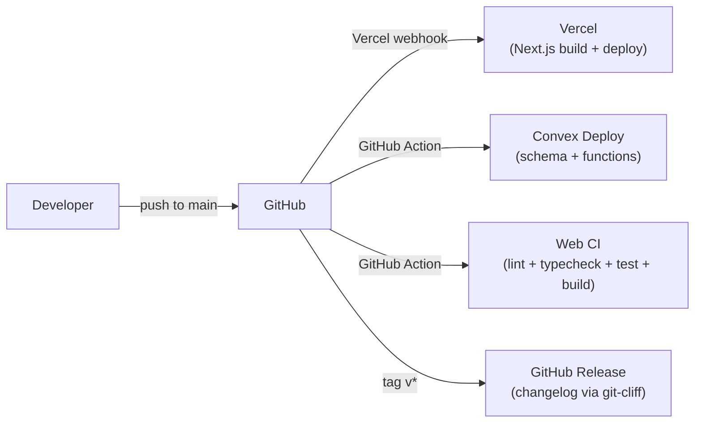

# Deployment

This document covers how Piol is deployed, including CI/CD pipelines, environment variables, and production setup.

## Table of Contents

- [Overview](#overview)
- [CI/CD Pipelines](#cicd-pipelines)
- [Environment Variables](#environment-variables)
- [Setting Up a New Environment](#setting-up-a-new-environment)
- [Monitoring](#monitoring)

## Overview

Piol uses a dual-deploy architecture:

| Component | Platform | Trigger | Config |
|-----------|----------|---------|--------|
| Next.js web app | Vercel | Push to `main` | Vercel project settings |
| Convex backend | Convex Cloud | Push to `main` (GitHub Action) | `.github/workflows/convex-deploy.yml` |



## CI/CD Pipelines

### Web CI (`.github/workflows/web-ci.yml`)

Runs on pushes and PRs to `main` that touch `apps/web/`, `packages/`, or `biome.json`.

**Jobs (run in parallel):**

1. **lint** - Runs `bunx biome check .`
2. **typecheck** - Runs `bunx tsc --noEmit` in `apps/web`
3. **test** - Runs `bun run test` in `apps/web`

**Then (after all pass):**

4. **build** - Runs `bun run build` in `apps/web`

### Convex Deploy (`.github/workflows/convex-deploy.yml`)

Runs on pushes and PRs to `main` that touch `packages/convex/`.

**Jobs (sequential):**

1. **typecheck** - Generates Convex types and runs TypeScript check
2. **test** - Runs vitest backend tests
3. **deploy-production** - Deploys to Convex production (only on push to `main`, not PRs)

### Release (`.github/workflows/release.yml`)

Runs on version tags (`v*`). Generates a changelog using [git-cliff](https://git-cliff.org/) and creates a GitHub Release.

### Claude Code Review (`.github/workflows/claude-code-review.yml`)

Runs on PR open or when `@claude` is mentioned in a PR comment. Uses Claude Haiku to review for security issues, bugs, and performance concerns.

## Environment Variables

### Vercel (Next.js Web App)

Set these in the Vercel project dashboard under Settings > Environment Variables.

| Variable | Required | Description |
|----------|----------|-------------|
| `NEXT_PUBLIC_CONVEX_URL` | Yes | Convex deployment URL (e.g., `https://your-project.convex.cloud`) |
| `NEXT_PUBLIC_CLERK_PUBLISHABLE_KEY` | Yes | Clerk publishable key for frontend auth |
| `CLERK_SECRET_KEY` | Yes | Clerk secret key for server-side auth |
| `NEXT_PUBLIC_MAPBOX_TOKEN` | Yes | Mapbox access token for maps |
| `NEXT_PUBLIC_SENTRY_DSN` | No | Sentry DSN for error tracking |
| `SENTRY_AUTH_TOKEN` | No | Sentry auth token for source map uploads |
| `SENTRY_ORG` | No | Sentry organization slug |
| `SENTRY_PROJECT` | No | Sentry project slug |
| `NEXT_PUBLIC_APP_NAME` | No | App display name (defaults to "Piol") |

### Convex Dashboard

Set these in the Convex Dashboard under Settings > Environment Variables.

| Variable | Required | Description |
|----------|----------|-------------|
| `CLERK_JWT_ISSUER_DOMAIN` | Yes | Clerk domain for JWT verification (e.g., `https://your-clerk-domain.clerk.accounts.dev`) |

### GitHub Secrets

Set these in the GitHub repository under Settings > Secrets and variables > Actions.

| Secret | Used By | Description |
|--------|---------|-------------|
| `CONVEX_DEPLOY_KEY` | Convex Deploy workflow | Convex deploy key for production deployment |
| `CONVEX_URL` | Web CI workflow | Convex URL for build-time validation |
| `ANTHROPIC_API_KEY` | Claude Code Review workflow | API key for automated PR reviews |

### Clerk JWT Template

A JWT template named `convex` must be created in the Clerk Dashboard with the default claims. This template is used by the `ConvexProviderWithClerk` to pass authenticated user identity to Convex functions.

## Setting Up a New Environment

### Prerequisites

- Node.js >= 20
- Bun >= 1.2
- Git

### Steps

1. **Clone and install:**
   ```bash
   git clone <repo-url>
   cd piol
   bun install
   ```

2. **Set up Clerk:**
   - Create a Clerk application at [clerk.com](https://clerk.com)
   - Create a JWT template named `convex` with default claims
   - Copy the publishable key and secret key

3. **Set up Convex:**
   - Run `bunx convex dev` in `packages/convex/` to create a new Convex project
   - Set `CLERK_JWT_ISSUER_DOMAIN` in Convex Dashboard environment variables
   - Copy the deployment URL

4. **Set up Mapbox:**
   - Create an account at [mapbox.com](https://www.mapbox.com/)
   - Generate an access token

5. **Configure environment:**
   Create `apps/web/.env.local`:
   ```env
   NEXT_PUBLIC_CONVEX_URL=https://your-project.convex.cloud
   NEXT_PUBLIC_CLERK_PUBLISHABLE_KEY=pk_test_...
   CLERK_SECRET_KEY=sk_test_...
   NEXT_PUBLIC_MAPBOX_TOKEN=pk.eyJ...
   ```

6. **Run development servers:**
   ```bash
   bun run dev        # Web + Convex
   ```

7. **Seed test data (optional):**
   ```bash
   bun run seed       # Populate with test data
   ```

### Vercel Deployment Setup

1. Import the repository in Vercel
2. Set the root directory to `apps/web`
3. Override the build command to: `cd ../.. && bun run vercel:build`
4. Add all environment variables from the table above
5. Vercel auto-deploys on push to `main`

### Convex Production Deployment

1. Generate a deploy key in the Convex Dashboard
2. Add `CONVEX_DEPLOY_KEY` to GitHub Secrets
3. The GitHub Action automatically deploys on push to `main`

## Monitoring

### Sentry (Error Tracking)

The web app integrates with Sentry via `@sentry/nextjs`. When configured:
- Client-side errors are captured automatically
- Server-side errors in API routes are captured
- Source maps are uploaded during build for readable stack traces

### Vercel Analytics

Built-in Vercel Analytics and Speed Insights are enabled in the root layout (`apps/web/src/app/layout.tsx`):
- `@vercel/analytics` - Page view and event tracking
- `@vercel/speed-insights` - Core Web Vitals monitoring

### Convex Dashboard

The Convex Dashboard provides:
- Real-time function logs (queries, mutations, actions)
- Database explorer and document viewer
- Scheduled function monitoring
- Error tracking and alerting
- Usage metrics and quotas
